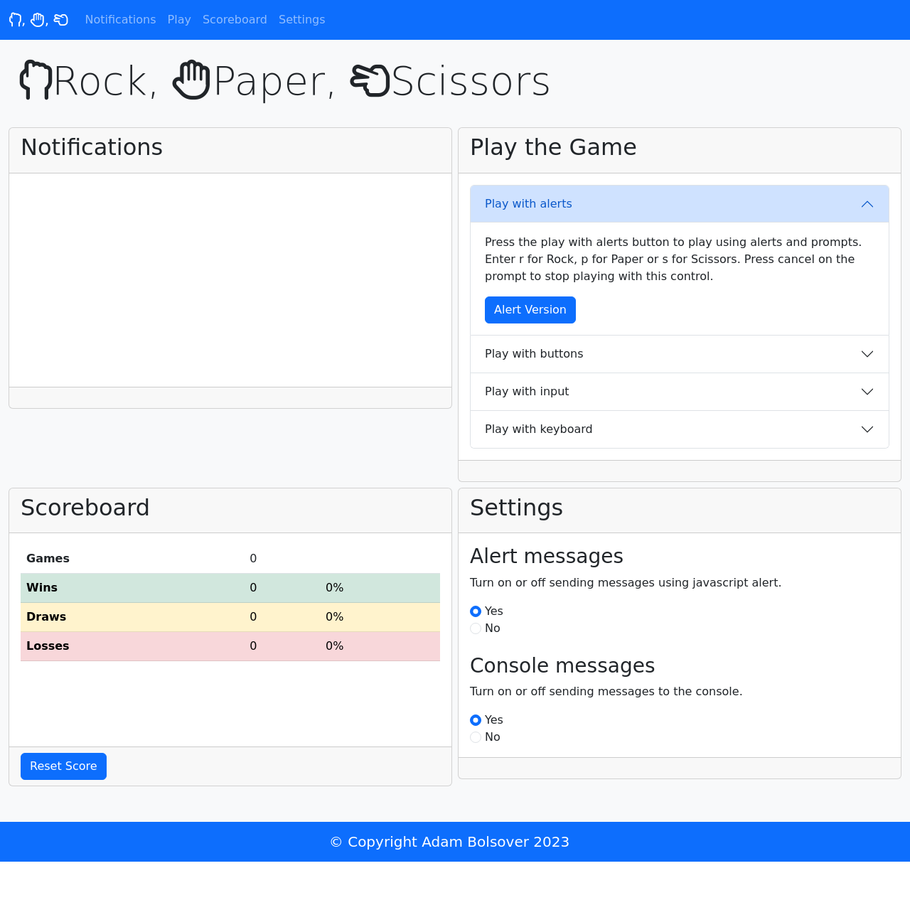

# Bootcamp Mini Project / Odin Project - Rock, Paper, Scissors

## Description 

This project was created using HTML, CSS, Boostrap v5 and Javascript to make a Rock, Paper, Scissors game. The project had the following requirements:

* Code out the rock-paper-scissors game.
* The player will play Rock, Paper, Scissors against an automated opponent.
* The player can enter R(ock), P(aper), or S(cissors) to signify my choice of rock, paper, or scissors.
* The computer will choose R(ock), P(aper), or S(cissors) in return.
* There should be the option to play again whether I win or lose.
* We should see total wins, ties, and losses after 10 rounds.
* The computer's selection must be random to ensure a fair game.

The page in this repo is the result.

## Installation

The site does not require installation steps.

## Usage 

The website can be viewed at [https://bowseruk.github.io/rock-paper-scissors/](https://bowseruk.github.io/rock-paper-scissors/) with Google Chrome. The source can be viewed in Chrome by right clicking and selecting inspect.

## Credits

This site was based on a project by edX Boot Camps LLC, and also on a project by [The Odin Project](https://www.theodinproject.com/).

[W3School](https://www.w3schools.com/) was used as a reference for elements to use and good practice.

The changes were checked with [W3C Validator](https://validator.w3.org/).

The docs for [Bootstrap v5](https://getbootstrap.com/docs/5.0/getting-started/introduction/) where heavily used.

[Stack Overflow](https://stackoverflow.com/) always seems to have the answer to a problem that occurs.

[MDN](https://developer.mozilla.org/en-US/) is a very comprehensive and useful resource.

## License

This project uses the licence in the LICENCE file of the repo.
